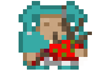
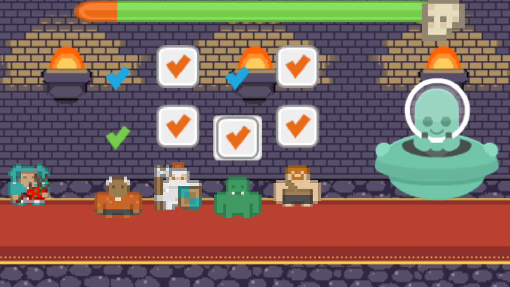
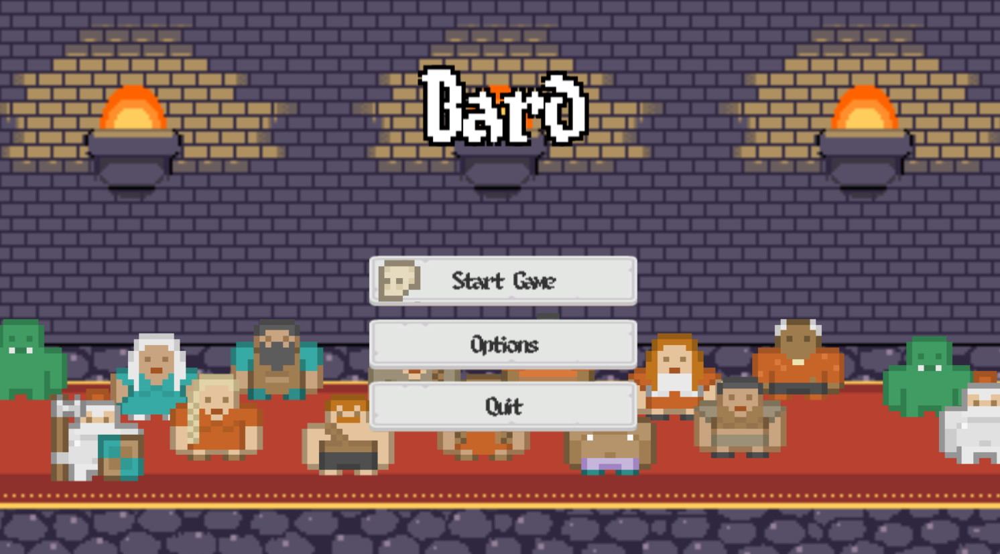

# Bard
Bard is a game that is played with a modified guitar that is used as a controller for the game. Your goal in the game is to keep your allies alive through a boss fight by topping off their Health and Mana.

# Controls
Bard is meant to be played with a real guitar but in such a case that you are unable to hook one up you can play with the arrow keys and space bar.

# HackUMass

This game was made in 36 hours during the fourth annual Hack UMass [http://hackumass.com](http://hackumass.com).

# Made by team: In the woods
 - Andy MacGregor
 - Griffin Nozell
 - Kevin Le
 - Mohamed Ibrahim

# Pictures
###Bard: The Hero

###Boss Battle

###Main Menu

# License
This game is released under the MIT License
